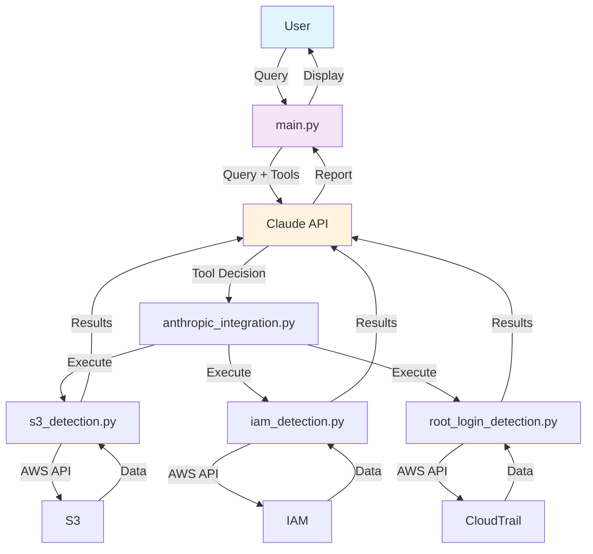
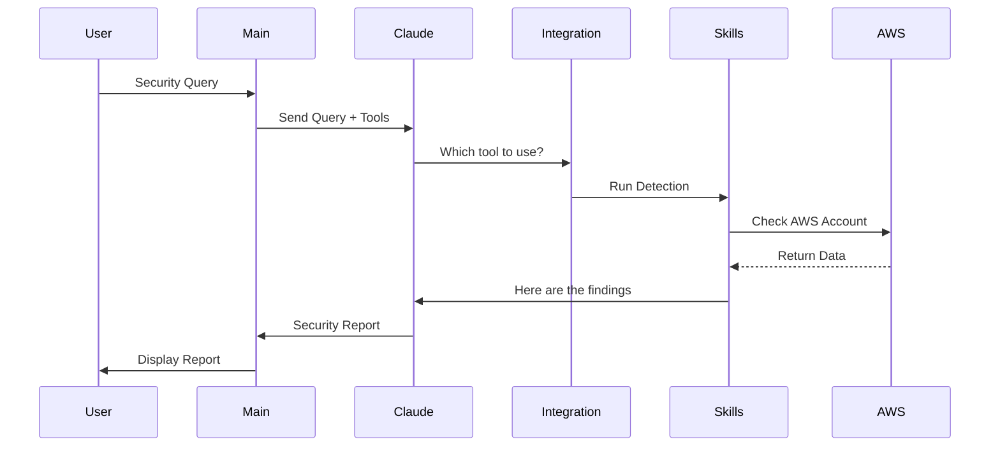

# AWS Security Detection Agent - Architecture

## System Overview



## Data Flow



## Project Structure

```
aws-security-agent-skills/
├── skills/
│   ├── s3_detection.py
│   ├── iam_detection.py
│   └── root_login_detection.py
├── tools/
│   ├── tool_definitions.py
│   └── anthropic_integration.py
├── utils/
│   ├── aws_client.py
│   └── logger.py
├── examples/
│   └── demo.py
├── main.py
├── requirements.txt
└── .env
```

## How It Works

1. **User enters a security query** (e.g., "Check my S3 buckets")
2. **main.py sends it to Claude** along with available tools
3. **Claude decides which tool to use** based on the query
4. **anthropic_integration.py executes the chosen tool**
5. **Detection skill runs AWS checks** (S3, IAM, CloudTrail)
6. **Results sent back to Claude** for analysis
7. **Claude formats a readable report**
8. **Report displayed to user**

## Tech Stack

- **Python 3.8+** — Code
- **Anthropic Claude** — AI Intelligence
- **boto3** — AWS API Access
- **python-dotenv** — Credentials Management

## Key Components

| File | Purpose |
|------|---------|
| `main.py` | User interface |
| `anthropic_integration.py` | Claude orchestration |
| `s3_detection.py` | Check S3 security |
| `iam_detection.py` | Check IAM risks |
| `root_login_detection.py` | Check root access |
| `aws_client.py` | AWS authentication |
